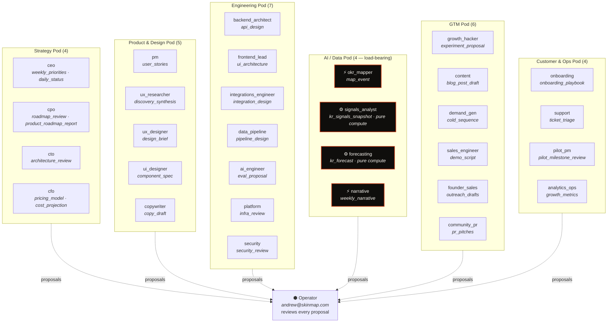
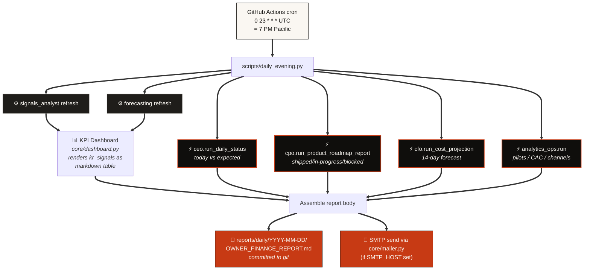
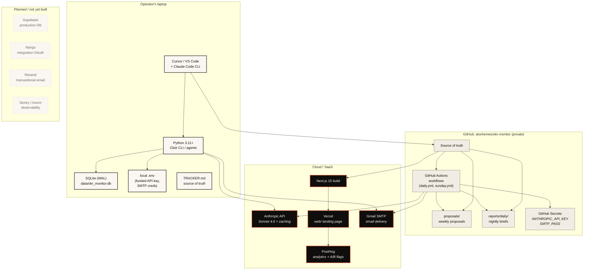

# Team & workflow diagrams

> Visual references for the 30-agent org, the data flow, and the tech stack.
>
> Diagrams are written in **Mermaid** — they render natively in GitHub markdown, Notion code blocks (set language to `mermaid`), Obsidian, and most modern markdown viewers. To edit, open the source `.md` file and modify the Mermaid block.

---

## 1. The 30-agent org chart

The company is structured as 6 pods + the operator. Every agent reports to the operator (Stage 0). Once an agent earns Stage 1 trust, it can act on its own outputs within scoped permissions.

**Legend:**
- ⚡ = LLM-driven agent (Anthropic API call per run)
- ⚙ = Pure-compute agent (no LLM, just reads/writes the database)
- ⬢ = Human operator (reviews every proposal)
- Bold-bordered = load-bearing (the product breaks if these break)

---

## 2. Data flow — how a single commit becomes a Friday narrative

```mermaid
graph LR
    subgraph Sources[" Where work happens "]
        GH["GitHub<br/>commit, PR"]
        LIN["Linear / Jira<br/>issue, comment"]
        SLK["Slack<br/>thread, message"]
        NOT["Notion<br/>doc update"]
    end

    Sources ==> WE["work_events<br/><i>UNIQUE on (source, source_event_id)<br/>idempotent ingest</i>"]

    WE ==> OM["⚡ okr_mapper<br/><i>per event:<br/>which KR(s)?<br/>confidence ≥ 0.5?</i>"]

    OM ==> EKM["event_kr_mappings<br/><i>(event, kr, confidence, reasoning)</i>"]

    EKM ==> SA["⚙ signals_analyst<br/><i>per KR:<br/>events_7d, events_30d,<br/>distinct_actors</i>"]

    SA ==> KRS["kr_signals<br/><i>rolling counts<br/>per KR per run</i>"]

    KRS ==> FC["⚙ forecasting<br/><i>per KR:<br/>required vs observed pace<br/>verdict: on_track / drifting / off</i>"]

    FC ==> KRS2["kr_signals<br/><i>verdict columns filled</i>"]

    KRS2 ==> NA["⚡ narrative<br/><i>weekly:<br/>verdict per KR + cited<br/>events + 'do this Monday'</i>"]

    NA ==> NAR["narratives<br/><i>markdown brief</i>"]

    NAR ==> EM["📧 Friday 9 AM email<br/>+<br/>📄 reports/proposals/...md<br/>committed to git"]

    classDef src fill:#FAF7F2,color:#0F0E0C,stroke:#1F1D1A;
    classDef store fill:#F2EDE4,color:#0F0E0C,stroke:#6B6862;
    classDef agent fill:#0F0E0C,color:#FAF7F2,stroke:#C73A14,stroke-width:2px;
    classDef out fill:#C73A14,color:#FAF7F2,stroke:#0F0E0C;
    class GH,LIN,SLK,NOT src;
    class WE,EKM,KRS,KRS2,NAR store;
    class OM,SA,FC,NA agent;
    class EM out;
```

---

## 3. Reporting flow — the daily 7 PM OWNER/FINANCE brief

---

## 4. Tech stack — what we run where

**Stack rationale (in 30 words each):**

| Tech | Why this, why not the alternative |
|---|---|
| **Python 3.11+** | Stdlib-rich, great Anthropic SDK, agents stay readable. Not Go: agents are mostly LLM glue, not perf-critical. |
| **SQLite (WAL)** | Zero ops, single file, good enough for ~1k pilots. Move to Supabase Postgres at first multi-tenant customer. |
| **Anthropic Sonnet 4.6 + prompt caching** | The cached system block (TRACKER.md + company.yaml) is ~4500 tokens; cache hit drops cost ~10×. Opus only for edge cases. |
| **GitHub Actions for cron** | First-class secret management, free for our scale, runs are visible in the UI. Better than the claude.ai routine for production cadences. |
| **Next.js 15 on Vercel** | Server components reduce JS shipped; Vercel's preview branches are the right deploy story for a marketing site iterating fast. |
| **PostHog** | A/B flags + analytics + session replay in one tool. Open-source-core, EU + US options for data residency. |
| **Tailwind + Fraunces + Inter + JetBrains Mono** | Editorial typography pairing avoids the generic SaaS look. Single accent color (persimmon) keeps signal high. |

---

## 5. Operator workflow — a typical week

```mermaid
gantt
    title  Operator week — what falls on the calendar
    dateFormat  HH:mm
    axisFormat  %a

    section Mon
    Read Sunday brief                     :08:30, 15m
    cli/review --all (last week's proposals) :09:00, 30m
    Standup grounded in brief             :10:00, 15m
    Daily 7pm brief lands                 :19:00, 5m

    section Tue
    Daily 7pm brief lands                 :19:00, 5m

    section Wed
    Daily 7pm brief lands                 :19:00, 5m
    Mid-week check on at-risk KRs         :15:00, 30m

    section Thu
    pilot_pm review (queue)               :10:00, 20m
    Daily 7pm brief lands                 :19:00, 5m

    section Fri
    Friday auto-narrative arrives         :09:00, 5m
    Forward brief to leaders              :09:30, 10m
    Daily 7pm brief lands                 :19:00, 5m

    section Sat
    Off                                   :00:00, 24h

    section Sun
    Sunday strategy pod fires (auto)      :18:00, 60m
```

**Total operator time per week on OKR Monitor itself: ~2 hours.** The product's job is to give back the hours your CoS used to spend playing telephone — not add ceremony.
